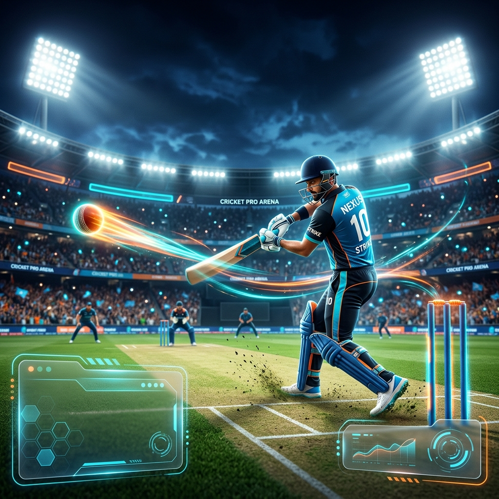

## 🌟 Overview

| 🏆 Logo | 🕹️ Mechanics |
| :--- | :--- |
| 
  
 | **Cricket Pro 3D** is an immersive, physics-based cricket simulation built for the web. Experience high-octane batting action in a stunning 3D stadium environment, featuring advanced lighting, realistic ball physics, and a responsive fielding AI. |

---

  

---

# Cricket Pro 3D 🏏

  

---

## 🚀 Key Features

- **🏟️ Next-Gen Visuals**: A beautifully rendered 3D stadium under floodlights with dynamic shadows and atmospheric effects.
- **⚾ Physics-First Engine**: Powered by `Cannon.js`, every ball trajectory, bounce, and bat-ball impact is calculated with high precision.
- **🛡️ Dynamic Bowling System**: Face a mix of **Fast** and **Spin** deliveries, each requiring unique timing and strategy.
- **⚔️ Advanced Batting Controls**:
  - **Drive (D)**: Classic grounded shots for precision.
  - **Loft (S)**: High-risk, high-reward power hitting.
  - **Defend (Space)**: Shield your wickets from dangerous deliveries.
  - **Leave (L)**: Smartly avoid balls outside the corridor of uncertainty.
- **🤖 Intelligent AI**: Dynamic fielders that chase, stop, and attempt catches based on the ball's speed and trajectory.
- **🔄 Stance Customization**: Switch between **Left-Handed** and **Right-Handed** perspectives at any time.
- **📊 Real-time HUD**: Keep track of your score, overs (2.0 over matches), and wickets (3 wicket limit) via a sleek glassmorphism interface.

---

## 🛠️ Tech Stack

  
  
  
  
  

---

## 🎮 How to Play

1. **Launch**: Open `index.html` in any modern web browser.
2. **Aim**: Use your **Mouse** to select the direction of your shot.
3. **Timed Hits**: Press the corresponding key (**D**, **S**, or **Space**) just as the ball reaches the batsman.
4. **Stance**: Click the **Toggle L/R Stance** button to match your preferred batting side.

### Controls Reference
| Key | Action |
| :--- | :--- |
| **D** | Grounded Drive |
| **S** | Lofted Shot |
| **Space** | Defensive Push |
| **L** | Leave Ball |
| **Mouse** | Aim Direction |

---
Created with passion by [Raza023](https://github.com/Raza023)
